# Autodesk Fusion Helix 3D Sketch Feature

An Autodesk Fusion add-in that creates parametric 3D helix, variable pitch helix, spiral and along-a-path sketch curves.

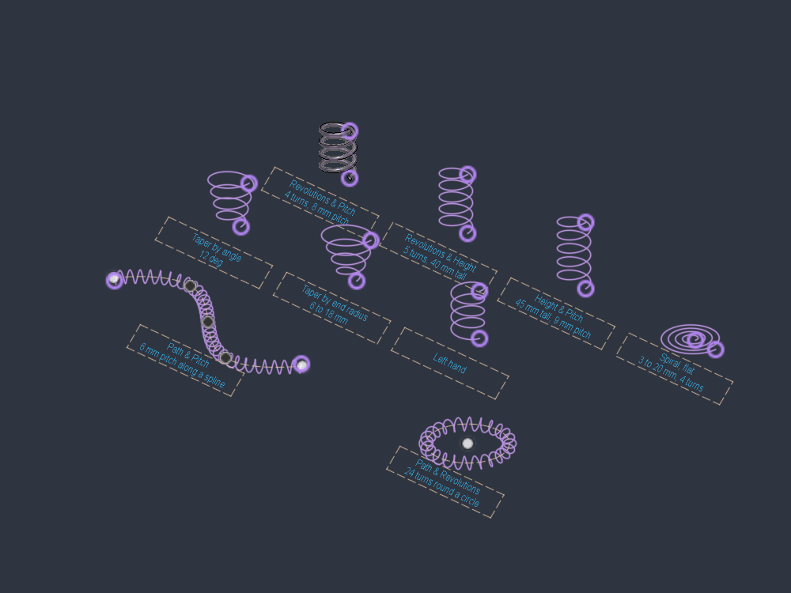

Fusion's own Coil command makes a solid. This one only ever makes a sketch curve, so you can sweep it, pattern it, use it as a path, or hand it to CAM, without a body you have to delete afterwards. The curve is a degree-3 non-rational B-spline through sampled helix points with exact end tangents, 24 samples per turn. Radial error measures well under a micron.

## What it can make

### Revolutions & Pitch

Turns plus the axial distance per turn. The example is 4 turns at 8 mm pitch, 10 mm radius.

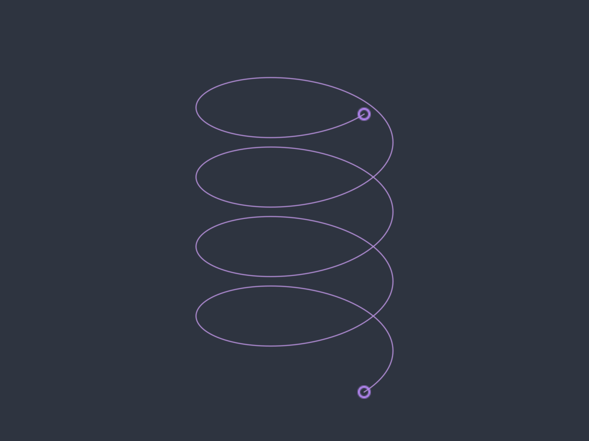

### Revolutions & Height

Turns plus overall height, and the pitch falls out of those. 5 turns over 40 mm here.

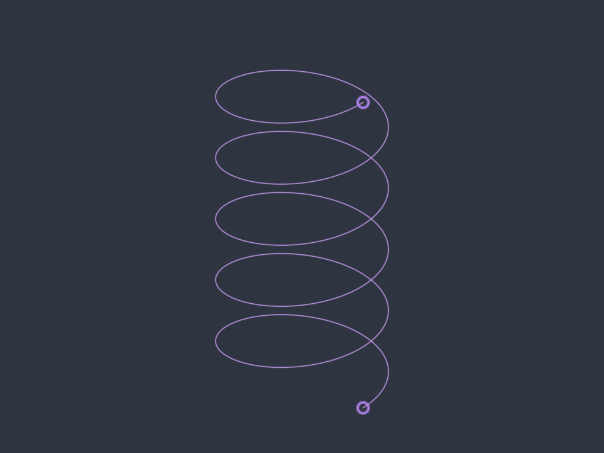

### Height & Pitch

Overall height plus pitch, and the number of turns falls out. 45 mm tall at 9 mm pitch.

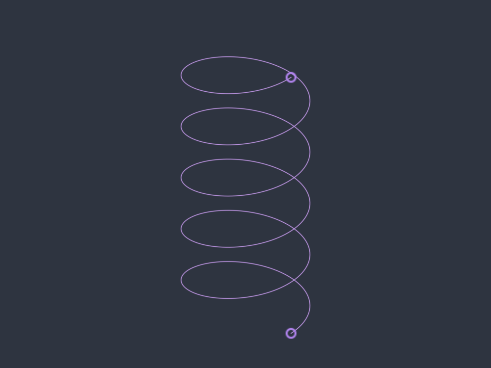

### Spiral (flat)

A flat spiral with a start and an end radius, no height. 3 mm out to 20 mm over 4 turns.

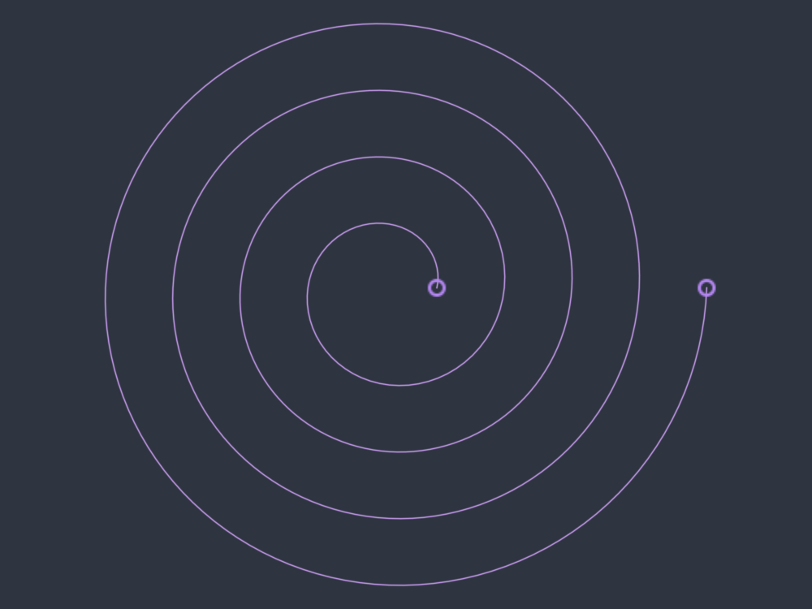

### Taper

Any of the helix modes can taper. Give it an angle:

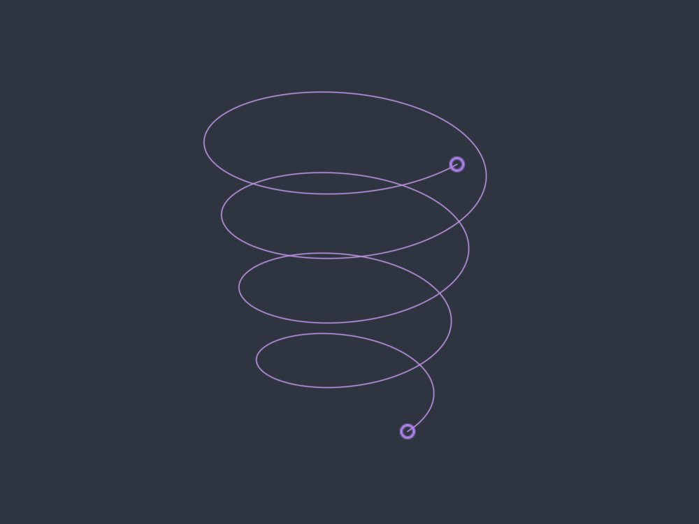

Or switch the Taper dropdown to By end radius and give it the radius you actually want to finish on, which saves working the angle out from the height. This one runs 6 mm to 18 mm:

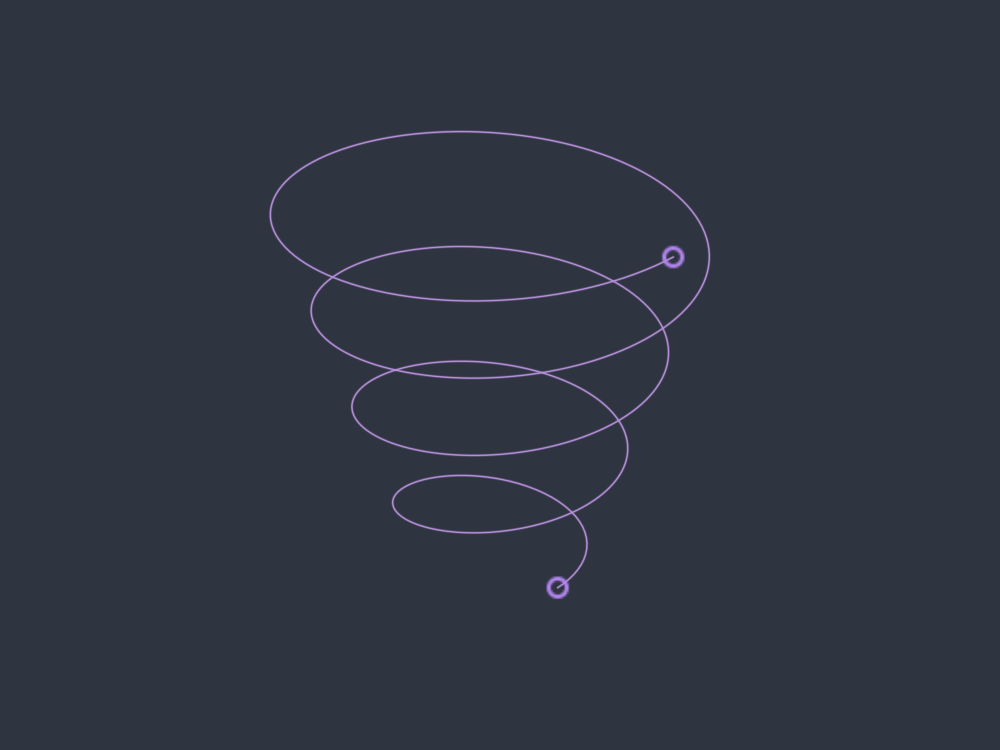

### Left hand

Direction flips the winding without touching anything else.

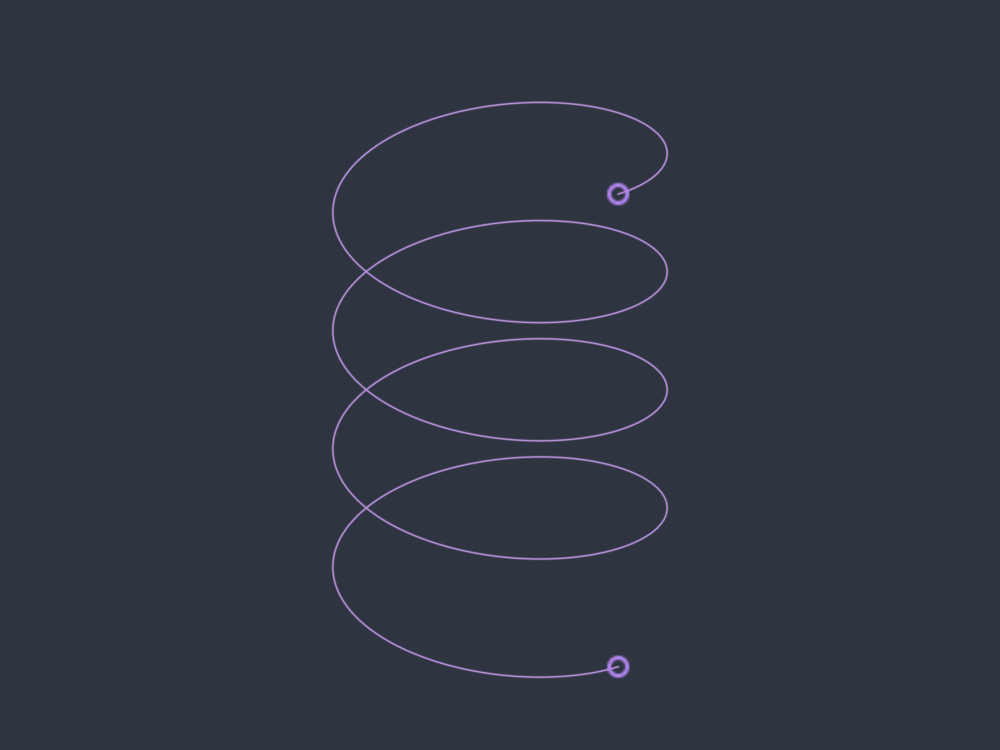

### Path & Pitch

Winds the helix around a curve you pick instead of a straight axis. Pitch is measured along the path, so it stays even around bends. 6 mm pitch, 4 mm radius, wound along a spline:

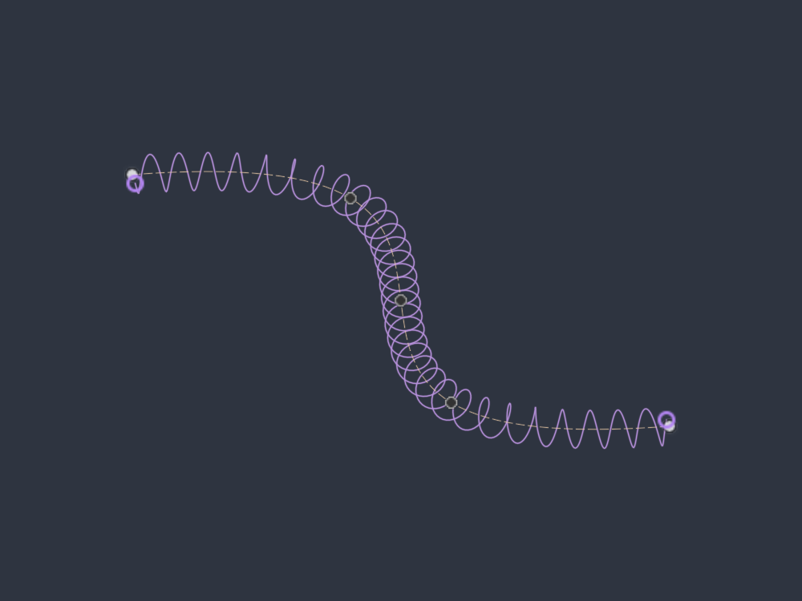

### Path & Revolutions

Same thing, but you say how many turns to fit along the path rather than the pitch. 24 turns round a circle:

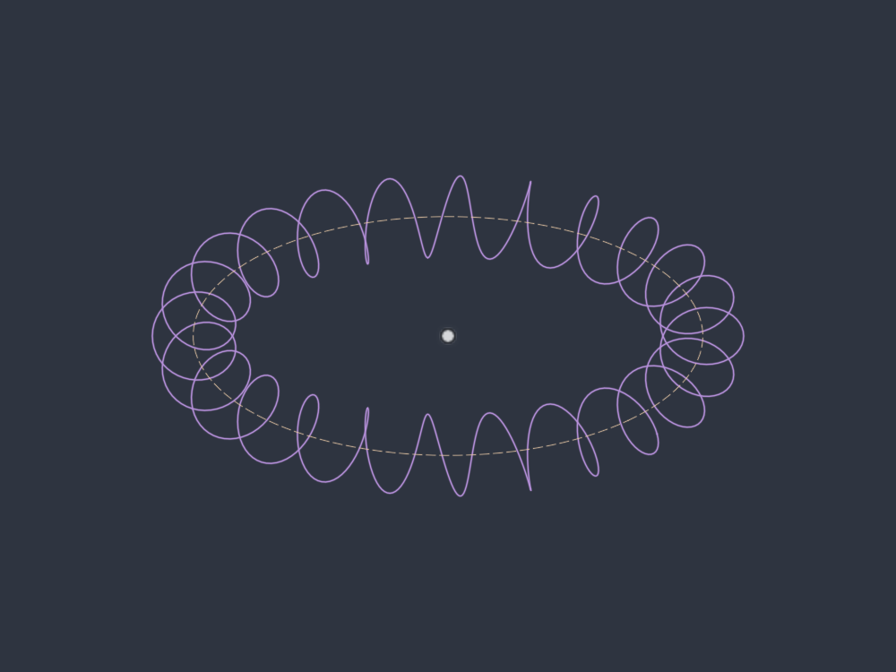

### Variable Pitch

This one is a second command, **Variable Pitch Helix**, for a helix whose pitch changes along its length. Fusion's Coil holds one pitch the whole way. Inventor's adds a transition and a flat end, which covers a closed-end spring and nothing else. This command takes a table instead.

You give it a table of stations. Station 1 is where the helix starts. Each row carries a pitch and a radius, and each row after the first says how many turns on from the row above it sits. Pitch is the rise per turn, so the height is not something you type: it falls out of the table, and the dialog tells you what it came to. Click into a row and an orange cross marks that station on the preview, with the run its turns value measures lit up behind it. Row 1 gets only the cross, because it is where the helix starts and has no run before it, which is what its turns cell is telling you when it says start.

**Ends** does what Inventor's coil ends do. Each end is Natural, which starts or finishes at the station as it stands, or Flat, which adds a run at the pitch you give for so many turns and then eases into the station over the transition turns. A pitch of zero is a true flat, which is what a timing screw dwell wants. For a closed spring end give it the wire diameter, or the sweep passes through itself.

Two jobs it was built for:

- **Progressive springs.** Start with a station at roughly the wire diameter, put the next one a turn later at the working pitch, and you have Inventor's transition and flat end. Give the active coils two different pitches and the rate climbs as the spring compresses.
- **Timing screws** for packaging and conveying lines. Two stations at the same pitch hold a constant lead. A rising pair accelerates the containers apart. Two stations both at zero pitch give you a dwell, where the flight carries on round without advancing the container.

**Blend** decides how the pitch gets from one station to the next. Smooth keeps the curvature continuous, so a section swept along the curve has no crease where the pitch changes. Linear ramps in a straight line, which is what SOLIDWORKS does, and leaves a small step in curvature at every station. Smooth is the default.

Two stations at the same pitch give you an exactly constant run in between, with no sag or overshoot part way along. That is what makes the dwells and the straight sections come out the length you asked for.

### It is a real curve

Nothing above is a picture of a coil. Sweep a section along one and you get a body like any other:

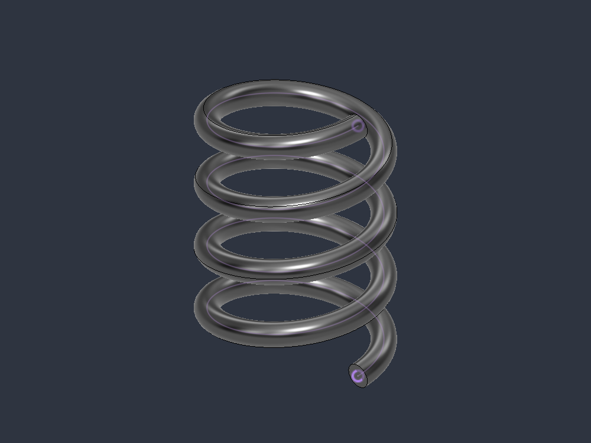

## Installation

1. Grab the latest `Helix3D-x.y.z.zip` from [Releases](https://github.com/RonnyM82/AutodeskFusionHelix3D/releases).
2. Extract it into your Fusion add-ins folder:
   - Windows: `%APPDATA%\Autodesk\Autodesk Fusion 360\API\AddIns`
   - Mac: `~/Library/Application Support/Autodesk/Autodesk Fusion 360/API/AddIns`

   The zip already contains a folder called `Helix3D`, so extracting it puts everything where Fusion expects it. If you clone the repository instead, rename the folder to `Helix3D` so it matches `Helix3D.py` and `Helix3D.manifest`. Fusion will not see the add-in otherwise.
3. In Fusion, go to **Utilities > Add-Ins**, find Helix3D on the Add-Ins tab, and run it. Tick "Run on Startup" if you want it back after a restart.
4. The **3D Helix** and **Variable Pitch Helix** commands appear in the Sketch Create and Solid Create panels.

IMPORTANT: if you change the manifest, restart Fusion completely. Fusion only reads it at startup, and a half-loaded add-in fails in ways that look like a bug in the command.

## Using it

The command behaves differently depending on whether you are in a sketch when you start it, so pick the one that suits what you are doing.

### As a timeline feature

Start the command with nothing being edited. You get a **Helix** feature in the timeline, wrapping a 3D sketch that holds the curve, and its values appear as rows in the Parameters dialog like any other feature.

1. Click **3D Helix** in the Sketch Create or Solid Create panel.
2. Pick a **Mode**.
3. Optionally pick a **Plane** for it to sit on. Leave it empty and it uses the XY plane, or the sketch plane belonging to the centre point you picked.
4. Optionally pick a **Center Point** to put the axis through, and a **Start Point** to say where the curve begins. A start point drives the radius, the start angle and the height offset, so those fields hide while it is set.
5. Fill in the fields for that mode, choose right or left hand, and click OK.
6. To change it later, right-click the feature in the timeline or the browser and choose **Edit Feature**.

NOTE: Mode and the Taper dropdown are greyed out when you edit an existing feature. Fusion fixes which parameters a custom feature owns at the moment it is created and gives no way to add or remove them afterwards, so switching between a taper angle and an end radius means making a new helix.

### Straight into a sketch

Start the command while you are editing a sketch and the curve goes into that sketch instead, with its definition stored on the curve.

1. Start or edit a sketch, then click **3D Helix**.
2. Position it either with the **Placement** triad and its **Base plane** dropdown, or by picking a **Center Point** and **Start Point**. Set both points and the triad disappears, because the points now decide everything it was deciding.
3. Leave **Finish sketch and create parametric feature** off to keep the curve in the sketch. Turn it on to close the sketch and wrap it as a Helix feature instead.
4. To edit one later, select the curve, right-click, and choose **Edit 3D Helix**.

An in-sketch helix follows its inputs the same way a feature does: type an expression that references a user parameter, or drag the point or path it is built on, and the curve rebuilds when the command finishes. The catch is that this only happens while the add-in is running, because the add-in is what re-evaluates it. The values also do not appear in the Parameters dialog, since the curve is not a feature. If you want rows in the Parameters dialog, use the timeline feature instead.

## Modes at a glance

| Mode | You give it | It works out |
| --- | --- | --- |
| Revolutions & Pitch | Turns, pitch | Height |
| Revolutions & Height | Turns, height | Pitch |
| Height & Pitch | Height, pitch | Turns |
| Spiral (flat) | Start radius, end radius, turns | A flat spiral |
| Path & Pitch | A path, pitch | Turns along the path |
| Path & Revolutions | A path, turns | Pitch along the path |

Radius, start angle and direction apply to all of them. Taper applies to everything except the flat spiral, which already works in start and end radii.

**Variable Pitch Helix** is a separate command rather than a mode, because it asks for a table rather than a couple of numbers. It works the same way otherwise: a timeline feature outside a sketch, a curve with its definition on it inside one, and the same centre point, start point and placement triad.

**Flip direction** runs the helix the other way: down the axis instead of up, or from the far end of the path back towards the start. It does not change whether the winding is right or left handed, so on a path helix with no taper and no change of radius there is nothing to see. Put a taper on it and the wide end swaps ends.

## Worth knowing

- The path modes take one curve at a time, a sketch curve or a body edge. Chained curves are not supported yet, so a path made of several joined segments needs to be one curve.
- Wind a helix around a tight corner with a radius larger than the corner and it will pass through itself. That is the geometry, not a bug, but the add-in does not warn you about it.
- A centre or start point has to come earlier in the timeline than the helix. Points that come later will not highlight when you try to pick them.
- The number of stations on a variable pitch helix, and whether each end is Natural or Flat, are fixed once you make it a feature, for the same reason Mode is: Fusion decides which parameters a custom feature owns when it is created. Changing either means a new helix. In a sketch you can change them whenever you like.
- On a variable pitch helix a start point sets the start angle and the height it starts at, but not the radius, because the radii come from the table.
- Give a spring a pitch smaller than the wire you sweep along it and the coils will pass through each other. Same for a timing screw with a dwell narrower than the flight. The add-in does not check for it.
- Developed against Fusion 2705.1.15 on Windows. It should be fine on Mac, I just have not tested it there.

## License

MIT, see [LICENSE](LICENSE).
